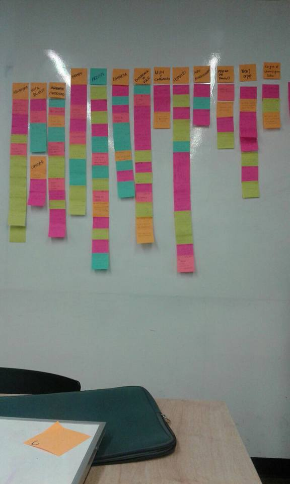
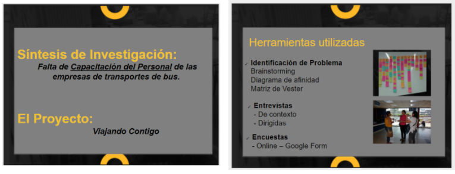
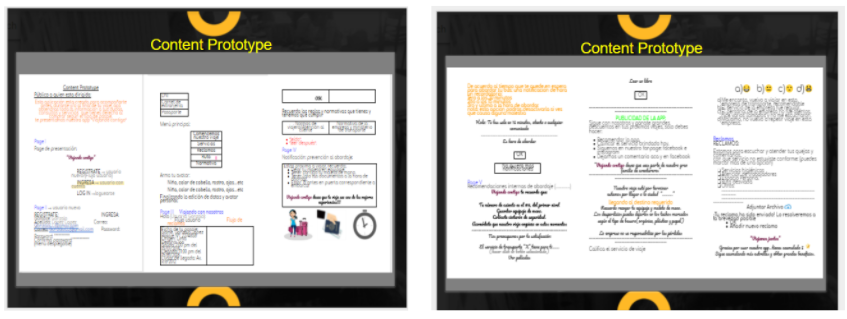

# PROYECTO: EXPERIENCIA DE USUARIO CENTRAL DE AUTOBUSES
# SQUAD: GeekDesign
### INTEGRANTES:
- Anaís
- Silvia
- Mariela
- Victoria
- Quiñones Jauregui, Yenny Elizabeth - yenny.quinones.jauregui@gmail.com

## RETO : NUEVA EXPERIENCIA EN EMPRESAS DE BUSES
Nos ha contactado Catalina una emprendedora viajera con una idea de negocio. Durante sus últimas vacaciones Catalina estuvo viajando por todo latinoamérica. Durante estos viajes Catalina tuvo que tomar muchos buses de todo tipo para llegar a ver los paisajes más lindos del continente. Durante sus viajes Catalina se dio cuenta que existen aún muchas oportunidades para mejorar la experiencia de todos los usuarios de este tipo de transporte: horarios, embarques, desembarques, compra de tickets en los terminales, compra de tickets online, cancelaciones, cambios de pasajes, etc. Adicionalmente, Catalina se dio cuenta que todas las plataformas de venta de tickets de bus tienen cosas por mejorar en Chile, Perú y México.

Luego de vivir todo esto, Catalina está pensando en emprender en este sector. Para ello ha contratado a tu squad para que la ayude a investigar más sobre los usuarios de este tipo de transportes y para que definan y prueben un MVP.

Con tu asesoría, ella podrá sustentar su idea de negocio a un grupo de inversión y así obtener el financiamiento necesario para emprender su negocio y mejorar la experiencia en este rubro."

## Proceso de Diseño

 

## Organización de Equipo
Objetivos:
- Trabajo en Equipo
- Aprendizaje conjunto
- Roles iguales
- Colaboración
- Mejora continua

Actividades:
- Lluvia de ideas para abordar problema de reto
- Identificación de Ejes temáticos del problema utilizando diagrama de afinidad.
- Definición de Plan de Investigación "Fase de Descubrimiento"
- Elaboración de Preguntas para Entrevista y Encuesta
- Elaboración de Cronograma de actividades
- Feedback
- Retrospectiva

Herramientas:
- Trello
- Grabadora de sonido
- Fotos
- Formularios Google
- Slack, WatsApp, Facebook, Search Google

Entregable:
- Estructura Proceso Ux Research realizado 
- Content prototype

# Proceso UX Research

### Objetivo general:

Atender las necesidades de Catalina...según lms.laboratoria.(seccion por modificar segun avance)

### Objetivo inicial (Martes 30/01/18)
 *Conocer la experiencia del usuario cuando usa una agencia de Bus interprovincial.*

### Planificación de actividades (Fase de descubrimiento)

Hora             | Actividad 
-----------------|----------------------------------------------------------------------------------------
    5:00 pm      | Brainstorming de las experiencias personales de la integrantes del squad como usuarias de una agencia de bus interprovincial.
    5:15 pm      | Affinity Map (Brainstorming).
    5:20 pm      | Brainstorming: Posibles soluciones a la problemática en base a experiencias personales.
    5:35 pm      | Affinity Map (Brainstorming).
    5:40 pm      | Retrospectiva.
    5:50 pm      | Planteamiento de metodologías UX Research en base al objetivo inicial: [ ] Trabajo de campo / entrevistas a usuarios. [ ] Encuestas online. [ ] Entrevistas a un experto.

Que mediante el trabajo de campo, entrevistas presenciales con el usuario y encuestas online se aborda de manera óptima la primera fase de descubrimiento .

Hora             | Actividad 
-----------------|----------------------------------------------------------------------------------------
   6:00 pm    | Formulación de preguntas para las entrevistas personales y encuestas virtuales - *colgar imagen de la encuesta.
   7:50 pm    | Retrospectiva.
   8:00 pm    | Finalización de formulario de preguntas y encuestas virtuales.

 1. Fijar y definir los espacios en donde se va realizar las entrevistas (Terminales terrestres)
 2. División en subgrupos para el trabajo de campo y horario de trabajo (grupo de 2 y 3 integrantes)
     - Inicio de trabajo:8:00 am.
     * Gpo A: Anais, Mariela y Yenny (Terminal Javier Prado).
     * Gpo B: Victoria y Silvia (Terminal Plaza Lima-Norte).

Hora             | Actividad 
-----------------|----------------------------------------------------------------------------------------
   8:30 pm    | Realizacion de speech para entrevista.
   9:00 pm    | Retrospectiva.

### DESARROLLO
### DESCUBRIMIENTO E INVESTIGACIÒN.
### Plan Research
1. Objetivos
   - Identificar patrones
2. Hipótesis
    - "La mejora de la experiencia de usuarios de transporte de viaje en bus con aplicación de tecnología intuitiva"
3. Métodos.
   Estudio en Campo - Entrevistas
4. Técnicas:
    - Observación
    - Comprensión ( Modelo Mental )
    - Análisis
5. Conducta
6. Sintetizar
7. Feedback
8. Retrospectiva

#### Procedimiento de actividades para el dia martes 30/01/18
>>>>>>> e93ecf3d95280787e12a16166ac80d69214922da

Hora             | Actividad 
-----------------|----------------------------------------------------------------------------------------
   8:00 am       | Inicio de trabajo de campo de acuerdo al lugar y grupo de trabajo.
   8:20 am       | Etapa de observación del ambiente y como se comporta el usuario en este.
   10:00 am      | Feedback (N°1) entre los integrantes del subgrupos respecto al desenvolvimiento con el entrevistado.
   11:30 am      | Finalización de las entrevistas (Denegación de solicitud de  permiso para realizar encuesta). *adjuntar imagen de correo - link.
   12:00         | Retrospectivas de las actividades realizadas.

### Investigando GRUPO A (terminal Javier Prado) En acciòn.

#### PASO 1:
- Tener a la mano preguntas de entrevistas, las preguntas son cualitativas abiertas, con la finalidad de conocer de forma mas detallada la experiencia de usuario.

 

#### PASO 2:
- Herramientas: Papel, Lapicero, celular.

#### PASO 3:
- Conocer la normatividad de la empresa de transportes
- Observar el contexto, nos proporciona una idea de como se desarrolla el dìa a dìa dentro de la empresa de transportes, ademàs se siente la molestia de los usuarios, por la espera al momento de su embarque, falta de asientos, colas al esperar informes, existen 3 cajas de atenciòn al cliente pero solo funcionaba una, y el calor, mientras que en la otra agencia estaba caso vacio.
  1. Mediante este primer metodo que es la observaciòn, podemos concluir que ambas agencias tienen personal frecuente, cuyo motivo de eleccion de agencia varia entre seguridad y comodidad vs precio, ademàs del tiempo de antiguedad de cada una.

 

 

#### PASO 4:
- Resumen de plan de ACCIÒN-GRUPO A

Hora                | Actividad
-----------------   |----------------------------------------------------------------------------------------
   08:30-11:05 a.m  | Entrevista agencia Cruz del Sur
   11:20-12:05 a.m  | Entrevista agencia Exclusiva
   12:20-01:00 p.m  | Entrevista agencia Movil Tours  
   01:05-02:00 p.m  | Camino a lugar de reunion para realizar retrospectica, y analisis de las entrevistas.
   02:05-03:30 p.m  | Break, y conclusiones acerca de la experiencia obtenida.
   03:40-5:40  p.m  | En transporte.
   07:00-11:00 p.m  | Cada una de las personas encargadas de las entrevistas, debe de pasar en limpio toda la informacion recolectada para su analisis a profundidad, lugar de concentraciòn de informaciòn GOOGLE DRIVE.

#### PASO 5:
- Conclusiones:
 

### Investigando GRUPO B (terminal Plaza Lima-Norte) En acciòn.

#### PASO 1:
- Tener a la mano preguntas de entrevistas, las preguntas son cualitativas abiertas, con la finalidad de conocer de forma mas detallada la experiencia de usuario, tener incentivos que motiven a los usuarios a contarnos sus experiencias.

 

#### PASO 2:
- Herramientas: Papel, Lapicero y celular.

#### PASO 3:
- Observar el contexto: En este caso el contexto es bastante variado, las oficinas de cada una de las agencias estan concentradas en un solo lugar, por lo que el usuario se siente libre de elegir donde mas se acomoda, cada usuario presenta diferentes preferencias, algunos definen que la seguridad es lo mas importante, otros la economia, los ambientes son bastante amplios, existen colas en horas punta donde los asientos son poco accesibles por lo que los usuarios deben de tirarse al piso hasta esperar la salida de su autobus.
  1. Mediante este primer metodo que es la observaciòn, podemos concluir que la gran varidad de agencias conglomeradas en un solo lugar, y esto brinda al pasajero la facilidad de elecciòn segun su criterio.

 

#### PASO 4:
- Resumen de plan de ACCIÒN-GRUPO B

Hora                | Actividad
-----------------   |----------------------------------------------------------------------------------------
   08:30-12:30 a.m  | Entrevista terminal plazaNorte.   
   12:45-02:15 p.m  | Analisis de las entrevistas y refrigerio.
   02:30-04:00 p.m  |Entrevista a la experta Dra. Mariel Quea (Administradora de Empresas   Hosteleras y Licenciada en Educación,Magister en                      |Ecoturismo y Magister en Gestión Educativa. Ejecutiva en gestión y evaluación de calidad en empresas hoteleras y turísticas.)  
   04:20-6:30 p.m   |Transporte.
   07:00-11:00 p.m  |Cada una de las personas encargadas de las entrevistas, debe de pasar en limpio toda la informacion recolectada para su analisis a profundidad, lugar de concentraciòn de informaciòn GOOGLE DRIVE.

1. Objetivos:
   - Objetivo inicial:Identificar patrones 
   - Objetivo final: Solución en base a la problemática encontrada "Falta de Capacitación del Personal de las empresas de transportes de bus".
   
2. Hipótesis
    - Hipótesis inicial:"La mejora de la experiencia de usuarios de transporte de viaje en bus con aplicación de tecnología intuitiva".
    - Hipótesis final:"La falta de capacitacion del personal de las empresas de transporte produce que el usuario tenga poca información sobre su viaje, ocasionandole una pesima experiencia de viaje".
3. Métodos.
   Estudio en Campo - Entrevistas
4. Técnicas:
    - Observación
    - Comprensión ( Modelo Mental )
    - Análisis 
5. Conducta
6. Sintetizar
7. Feedback 
8. Retrospectiva
=======
#### PASO 5:
- Conclusiones:
 

### Analisis de resultados de encuentas via web, y foros.
#### PASO 1:
- Se revisa la data obtenida directo en google drive, se filtra y se genera el reporte para el analisis, en cuanto a los foros, se busca informaciòn en foros mediante la web, ademàs se encuenta a amigos y conocidos que no pueden acceder mediante la web pero nos pueden dar sus comentarios sobre su experiencia de viaje.

 

#### PASO 2:
-Conclusiones: Las conclusiones obtenidas, son similares a las obtenidas en las encuentras presenciales, existe un sinnumero de quejas, por seguridad, comidad, precios, mala atencion, alimentacion y muchas porque el chofer no descansa sus horas necesarias para emprender un viaje largo lo que termina en muchas ocasiones en accidentes.

######  Actividades comunes en GRUPO-A y GRUPO-B 

Hora             | Actividad (MARTES 30/01/2018)
-----------------|----------------------------------------------------------------------------------------
   8:00 pm       | Creacion y actualización de espacios de documentacion (Github ,Google Docs y Google Drive)
   8:30 pm       | Compilación de la data recolectada en las entrevistas presenciales
`  10:00 pm      | Análisis e interpretación de la información recabada
   11:00 pm      | Investigación de otras fuentes de información (foros, reclamos de usuarios en las redes sociales de las agencias de bus interprovincial).

#### Conclusiones Generales ambos grupos.

 

#### Metodologia de analisis de proceso de descubrimiento.

## Diagrama de afinidad.
### PASO 1:
- Lluvia de informaciòn deacuerdo a lo obtenido en las entrevistas.

### PASO 2:
- Analizamos y elegimos las posibles problematicas que mas predominan.

## Siguiente paso, elaboramos nuestro user persona.

## Siguiente paso, Content Prototype.

2- Revisión de Data ya existente.

    2.1- revisión de literatura del proceso ( normativa )  
    2.2- revisión de data existente ( foros, comunidades)  
    2.3- Research Cuantitativo: revisión de análisis existente ( conclusiones ya existentes, estudios,
       investigaciones).

## Presentacion final

### NICE TO HAVE
## Storyboard.

